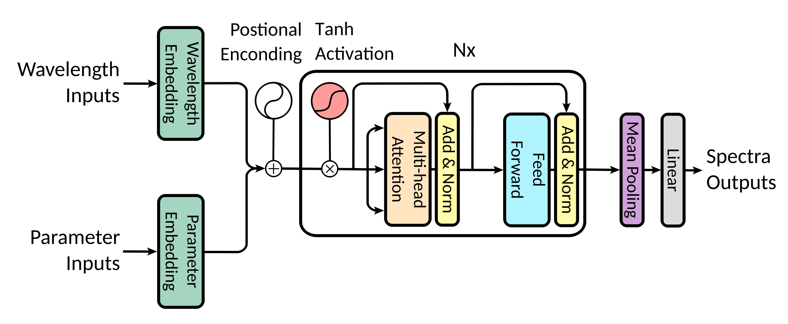
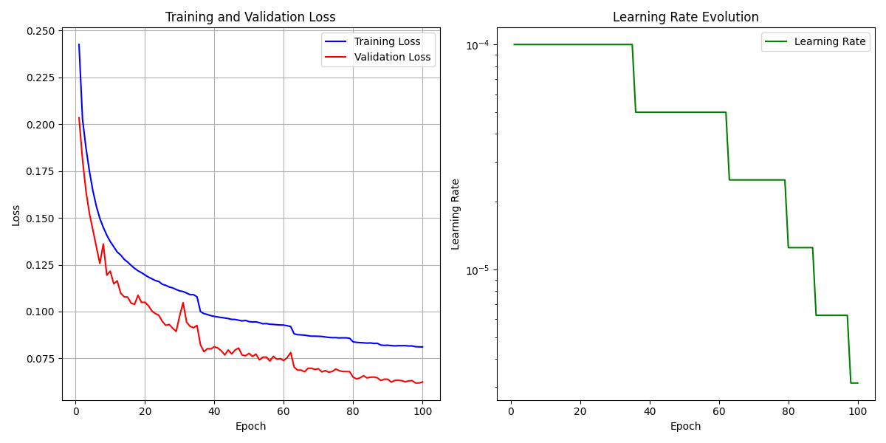
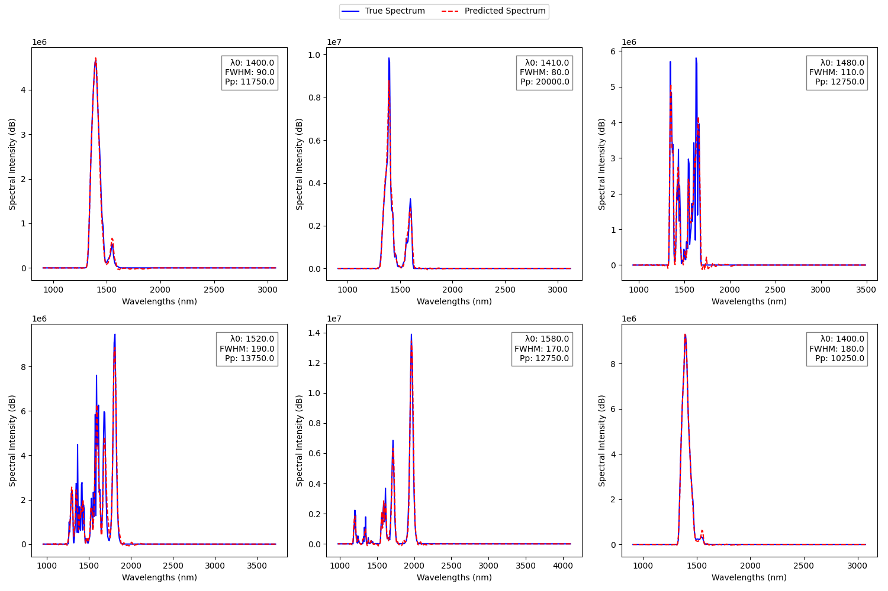

# Application of Deep Learning in Supercontinuum Generation

This repository contains the source code for a project that implements a Transformer-based architecture to generate supercontinuum based on governing parameters and wavelengths. Following is a study on the capabilities of Transformers to model nonlinear dynamical systems in physics and nature.

# Features

## loader.py

This code implements a framework for loading, preprocessing, and splitting spectral data to use for our ```SpectrumTransformer``` model.
* ```class SpectrumDataset()```: This class encapsulates the data loading logic, enabling efficient handling of parameters, wavelengths, and spectra within the PyTorch framework.
* ```bin_spectra_waves()```: This function performs binning and averaging operations on spectra and wavelengths to potentially improve model performance and save memory. The average spectral intensity, denoted as ($\bar{S}$), is calculated as follows: $\bar{S} = \frac{1}{\lambda_b - \lambda_a} \int_{\lambda_a}^{\lambda_b} S(\lambda) d\lambda$ where $\lambda_a$ and $\lambda_b$ are the starting and ending wavelengths of a given bin, respectively. The average wavelength is the mean of the wavelengths within a bin.
* ```load_data()```: It handles data loading, binning, standardization, and splitting into training, validation, and testing sets, promoting consistent data preparation for machine learning tasks.

## spectrumtransformer.py

* ```class SpectrumTransformer()```: This class implements a Transformer-based model to predict supercontinuum generation spectra based on input parameters and wavelength data.

<div align=center> </div>

* ```class PositionalEncoding()```: This class encodes positional information within the sequence using sinusoidal positional encoding as described by Vaswani et al. (2017).

## train.py

* ```train_model()```: This function trains the model using the specified optimizer and learning rate scheduler, monitoring training and validation loss. Implements early stopping to prevent overfitting and saves the best model.

<div align=center> </div>

* ```evaluate_model()```: This function evaluates the trained model on the test dataset, calculating the average test loss and generating visualizations of predicted vs. actual spectra.

<div align=center> </div>

## main.py

This script runs the supercontinuum prediction pipeline, loading hyperparameters, creating the model, training it on the specified dataset, evaluating its performance and visualising on a held-out test set. Test loss is ```0.0250```.

# References

[1] Salmela, L., Tsipinakis, N., Foi, A., Billet, C., Dudley, J. M., & Genty, G.
(2021). Predicting ultrafast nonlinear dynamics in fibre optics with a recurrent
neural network. Nature Machine Intelligence, 3(4), 344-354.

[2] Stucchi Diego, Corsini Andrea, Genty Goery, Boracchi Giacomoand Foi
Alessandro, “Supercontinuum Spectra”. Zenodo, Feb. 23, 2022. doi:
10.5281/zenodo.6241344.

[3] Vaswani, A., Shazeer, N., Parmar, N., Uszkoreit, J., Jones, L., Gomez, A. N.,
... & Polosukhin, I. (2017). Attention is all you need. Advances in neural
information processing systems, 30.

[4] Zhou, Haoyi, et al. "Informer: Beyond efficient transformer for long
sequence time-series forecasting." Proceedings of the AAAI Conference on
Artificial Intelligence. Vol. 35. No. 12. 2021.

[5] Grigsby, J., Wang, Z., & Qi, Y. (2021). Long-range transformers for dynamic
spatiotemporal forecasting. arXiv preprint arXiv:2109.12218.

[6] Huang, L., Mao, F., Zhang, K., & Li, Z. (2022). Spatial-Temporal
Convolutional Transformer Network for Multivariate Time Series Forecasting.
Sensors, 22(3), 841.

[7] Kazemi, S. M., Goel, R., Eghbali, S., Ramanan, J., Sahota, J., Thakur, S.,
... & Brubaker, M. (2019). Time2vec: Learning a vector representation of time.
arXiv preprint arXiv:1907.05321.

[8] Chao Long, Yanmin Zhu, Haobing Liu, and Jiadi Yu. Efficient feature
interactions learning with gated attention transformer, 2021.
[9] Yanglin Huang, Donghui Tan, Yuan Zhang, Xuanya Li, and Kai Hu.
Transmixer: A hybrid transformer and cnn architecture for polyp segmentation,
2022

[10] Cao, K., Zhang, T. & Huang, J. Advanced hybrid LSTM-transformer
architecture for real-time multi-task prediction in engineering systems. Sci Rep 14,
4890 (2024).
